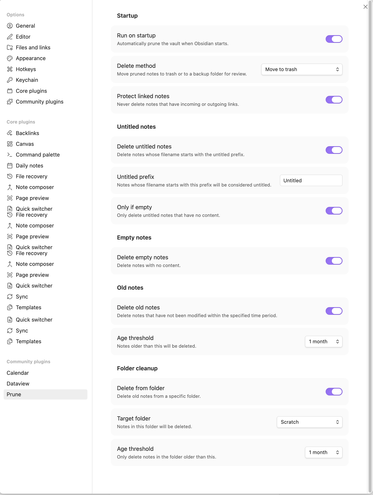

# Prune

An Obsidian plugin that keeps your vault clean by removing untitled drafts, empty notes, stale files, and clutter from specific folders — manually or on startup.

## Features

- 📝 **Untitled notes** — Delete notes matching a configurable prefix (e.g. "Untitled", "Untitled 1"). Optionally only if they're empty.
- 🕳️ **Empty notes** — Delete notes with no content.
- 🕰️ **Old notes** — Delete notes not modified in 1, 3, 6, or 12 months.
- 📁 **Folder cleanup** — Delete old notes from a specific folder, with a separate age threshold.
- 🔗 **Linked note protection** — Notes that are linked to by other notes are never deleted, so you won't break any references in your vault.
- 💾 **Backup before delete** — Optionally move pruned notes to a `prune-backup` folder in your vault root for review, instead of sending them straight to trash.
- 🚀 **Run on startup** — Optionally prune automatically when Obsidian launches.

## Settings

<!-- TODO: Add screenshot of settings tab -->

## Default behavior

Prune is conservative by default. Out of the box:

- Only **empty untitled notes** are deleted (prefix: "Untitled", only-if-empty: on).
- Linked note protection is **on** — any note referenced by another note is safe.
- Old notes, empty notes, and folder cleanup rules are **off**.
- Delete method is **trash** (your obsidian settings trash, so you can recover files).
- Run on startup is **off** — nothing happens until you run the command.

Prune only touches **markdown files**. Attachments, images, PDFs, and other file types are never affected.

## Usage

Open the command palette and run **Prune: Vault** to clean up your vault based on your enabled rules.

You can also enable **Run on startup** in settings to prune automatically when Obsidian launches.

## Installation

### From community plugins

Search for "Prune" in **Settings > Community plugins > Browse**.

### Manual

1. Download `main.js` and `manifest.json` from the [latest release](https://github.com/shiveenp/obsidian-prune/releases).
2. Create a folder at `VaultFolder/.obsidian/plugins/prune/`.
3. Copy both files into that folder.
4. Enable the plugin in **Settings > Community plugins**.
